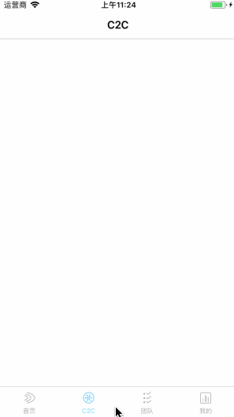

# XYTabBarAnimation
#tabbar点击动画效果图



#实现思路
## 利用`UITabBarController`的`UITabBarControllerDelegate`,实现代理方法
```objc
- (BOOL)tabBarController:(UITabBarController *)tabBarController shouldSelectViewController:(UIViewController *)viewController
```
### 下面是具体的实现代码
```objc
- (BOOL)tabBarController:(UITabBarController *)tabBarController shouldSelectViewController:(UIViewController *)viewController
{
    NSInteger index = [tabBarController.childViewControllers indexOfObject:viewController];

    UIButton *tabBarBtn = tabBarController.tabBar.subviews[index+1];
    UIImageView *imageView = tabBarBtn.subviews.firstObject;
    // 切换过了,就停止上一个动画
    if (self.currentIndex != index) {
        // 把上一个图片的动画停止
        [self.currentImageView stopAnimating];
        // 把上一个图片的动画图片数组置为空
        self.currentImageView.animationImages = nil;
    } else {
        return NO;
    }

    imageView.animationImages = self.allImages[index];
    imageView.animationRepeatCount = 1;
    imageView.animationDuration = ImageCount * 0.025;

    // 开始动画
    [imageView startAnimating];

    // 记录当前选中的按钮的图片视图
    self.currentImageView = imageView;
    // 记录当前选中的下标
    self.currentIndex = index;

    return YES;
}
```

+ `PS` 动画的实现,是利用的帧动画,设计对选中的图片做好帧动画图片给到我们